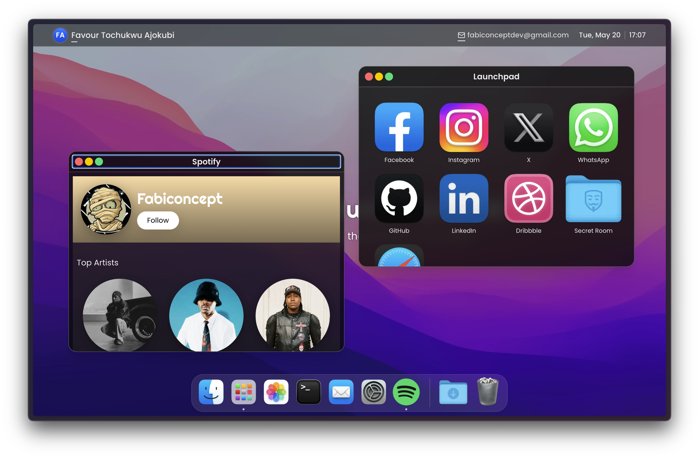

# 🖥️ Macintosh‑OS

[](https://github.com/fabiconcept/macintosh-os)
[](https://github.com/fabiconcept/macintosh-os/network)
[](LICENSE)


---

## 🎯 What is this?

**Macintosh‑OS** is a web‑based remake of the classic Macintosh desktop — fully interactive, fully responsive, and built with modern tech: Next.js, Tailwind CSS, and TypeScript. It’s not just nostalgic eye candy — it’s a foundation for a fun, retro‑style **personal portfolio**.

---

## 🔥 Live Demo

👉 [macintosh-os.vercel.app](https://macintosh-os.vercel.app)

---

## 📸 Preview

[](https://macintosh-os.vercel.app)

---

## 🛠️ Tech Stack

- **Next.js** – React framework, server‑side rendering, built‑in routing
- **Tailwind CSS** – utility‑first CSS, custom theming
- **TypeScript** – robust type safety
- **Vercel** – one‑click deployments

---

## ✨ Features

| Feature                     | Description |
|----------------------------|-------------|
| 🎨 Authentic UI            | Faithfully mimics classic Mac desktop interface |
| 🔲 Window Management       | Open, drag, resize, close app windows |
| 📱 Fully Responsive        | Works smoothly on desktops, tablets, and phones |
| ⚡ Performance Optimized   | Fast load times and smooth UX |
| 🪄 Themes & Configurable   | Easily swap icons, wallpapers, fonts—make it yours |
| 🧩 Portfolio-Ready         | Add custom apps/windows for projects, bio, resume, etc. |

---

## 🚀 Getting Started

### Prerequisites

- Node.js v14 or later  
- npm or Yarn

### Quick Start

```bash
git clone https://github.com/fabiconcept/macintosh-os.git
cd macintosh-os
npm install       # or yarn install
npm run dev       # or yarn dev
````

Then open `http://localhost:3000` in your browser and enjoy!

---

## 🖌️ Customize It

1. Swap `public/` assets (icons, wallpapers, fonts)
2. Edit config files for desktop apps, links, resume, etc.
3. Add your own interactive windows (e.g. Projects, Blog, Contact)
4. Deploy with Vercel — push to GitHub or use import link!

---

## 📌 Why Use This?

* Stand out with a nostalgic, interactive portfolio
* Showcase frontend skills and creativity
* Learn and customize Next.js + Tailwind + TypeScript + Vercel
* Impress recruiters with a unique user experience

---

## 🎉 Try It Out

Want to turn the classic Mac into your personal playground?

✔️ **Fork**, **edit**, **deploy**, and **show it off**!

Tag me or open an issue if you need help, or just to share screenshots — I’d *love* to see your spin on it 🙂

---

## 💡 Contribution & Support

Contributions are welcome! Feel free to:

* 🚧 Submit bug reports or feature ideas
* 🧑‍💻 Open pull requests
* ⭐ Star the repo if you enjoyed it!

---

## ℹ️ License & Credits

* **MIT License**
* Built by **[fabiconcept](https://github.com/fabiconcept)** — inspired by classic Macintosh aesthetic

---

## 📚 Resources & Inspiration

* 💡 ReadMe best practices
* 🎨 Retro design inspiration
* 🛠️ Web dev + creative coding mashups

---

*Made with 💖 by fabiconcept — go ahead, bring retro to the web!*
